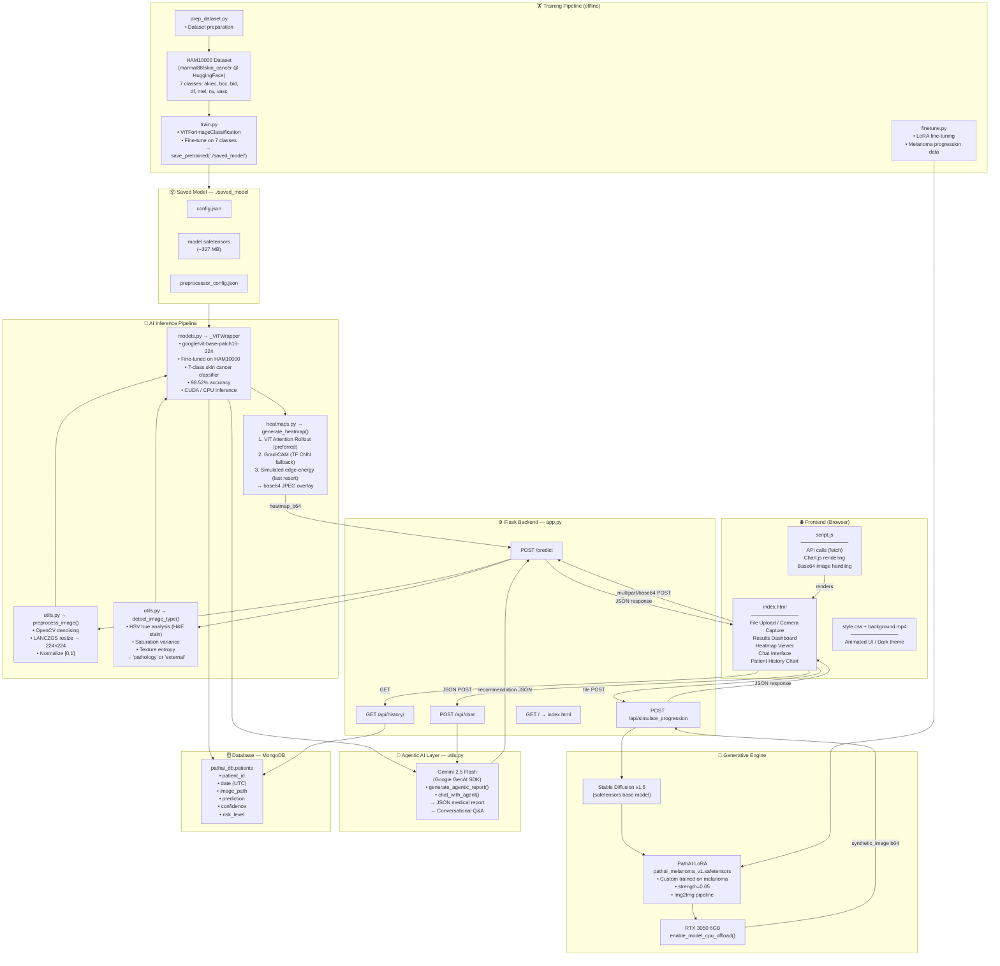
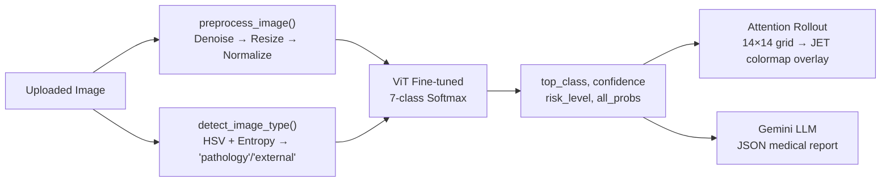
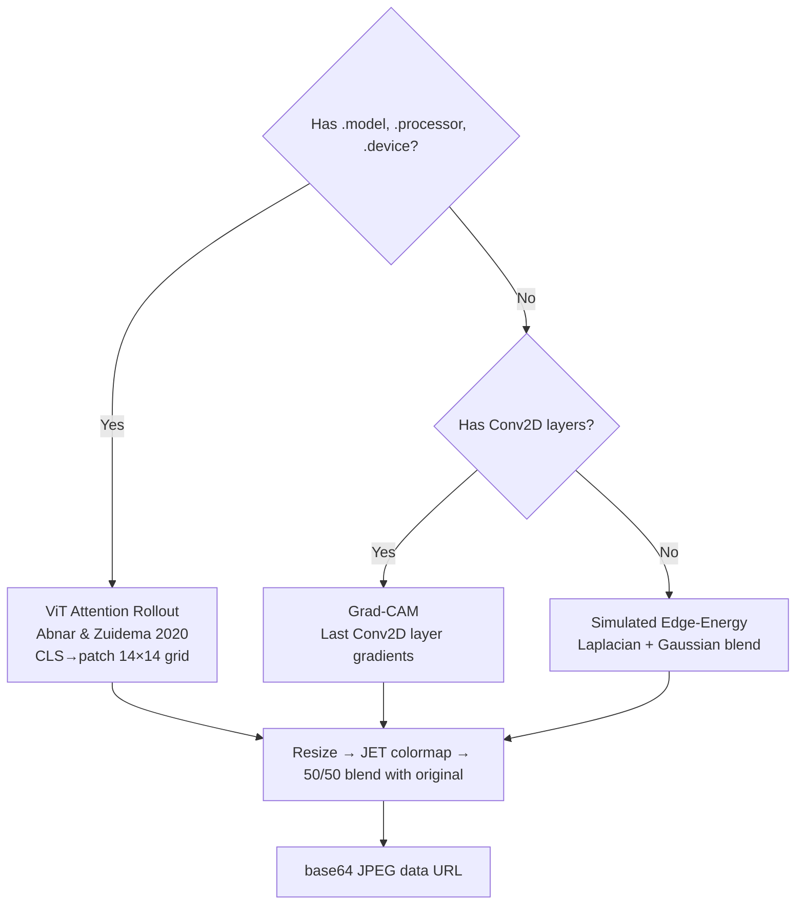
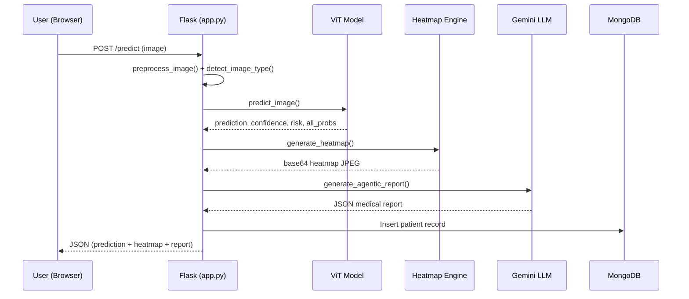

# Digital Pathology AI — Architecture Diagram

## System Overview

A full-stack AI-powered skin cancer analysis web application using a fine-tuned Vision Transformer (ViT), a Stable Diffusion generative engine, and a Gemini LLM agentic reporting layer.

---

## High-Level Architecture

---

## Component Breakdown

### 1. Frontend (`/templates` + `/static`)

| File | Role |
|---|---|
| `index.html` | Single-page app — upload, results, heatmap, chat, history |
| `script.js` | All client-side logic: API calls, Chart.js probability bars, camera capture |
| `style.css` | Dark-mode glassmorphism UI, animations |
| `background.mp4` | Animated video background |

---

### 2. Flask Backend (`app.py`)

| Route | Method | Description |
|---|---|---|
| `/` | GET | Serves `index.html` |
| `/predict` | POST | Main inference endpoint — file or base64 |
| `/api/simulate_progression` | POST | Stable Diffusion LoRA image-to-image |
| `/api/chat` | POST | Gemini-powered conversational Q&A |
| `/api/history/<patient_id>` | GET | Patient record fetch from MongoDB |

---

### 3. AI Inference Pipeline

---

### 4. ViT Model (`models.py` + `./saved_model`)

| Detail | Value |
|---|---|
| **Base Model** | `google/vit-base-patch16-224` |
| **Dataset** | HAM10000 (7-class skin cancer) |
| **Accuracy** | 98.52% |
| **Input** | 224×224 RGB, normalized `mean=0.5, std=0.5` |
| **Output** | 7-class softmax probabilities |
| **Hardware** | CUDA (RTX 3050) / CPU fallback |
| **Classes** | Actinic Keratoses, Basal Cell Carcinoma, Benign Keratosis, Dermatofibroma, Melanocytic Nevi, Melanoma, Vascular Lesions |

---

### 5. Heatmap Generation (`heatmaps.py`)

---

### 6. Generative Engine (`app.py` + `PathAI_LoRA/`)

| Detail | Value |
|---|---|
| **Base Model** | Stable Diffusion v1.5 (safetensors) |
| **LoRA Weights** | `pathai_melanoma_v1.safetensors` |
| **Pipeline** | `StableDiffusionImg2ImgPipeline` |
| **Strength** | 0.65 (preserves skin structure, adds melanoma texture) |
| **Input** | Any benign skin image (resized to 512×512) |
| **VRAM Strategy** | `enable_model_cpu_offload()` for RTX 3050 6GB |

---

### 7. Agentic AI Layer (`utils.py`)

| Function | Model | Output |
|---|---|---|
| `generate_agentic_report()` | Gemini 2.5 Flash | JSON: `medical_advice`, `preventive_routine`, `lifestyle_suggestions`, `maps_link`, `disclaimer` |
| `chat_with_agent()` | Gemini 2.5 Flash | Plain-text conversational response with diagnostic context |

---

### 8. Database (`MongoDB`)

| Collection | Fields |
|---|---|
| `pathai_db.patients` | `patient_id`, `date`, `image_path`, `prediction`, `confidence`, `risk_level` |

---

### 9. Training Pipeline (Offline)

| Script | Purpose |
|---|---|
| `train.py` | Fine-tune `google/vit-base-patch16-224` on HAM10000 → saves to `./saved_model` |
| `finetune.py` | LoRA fine-tuning for Stable Diffusion on melanoma images |
| `prep_dataset.py` | Dataset preparation and formatting |
| `ImportModel.py` | Model import utilities |

---

## Data Flow Summary

---

> **Tech Stack Summary:** Python · Flask · HuggingFace Transformers · PyTorch · Stable Diffusion (diffusers) · Google Gemini SDK · MongoDB · OpenCV · Vanilla JS · CSS3 · Chart.js
